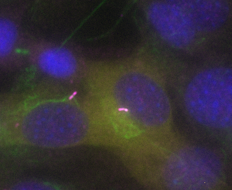

  

# Project 66: Automated Cilia Analysis

A collaboration with the group of Martin Engelke at Illinois State University. 

## Introduction

This project involves an automated detection and analysis of cilia length in cultured cells overexpressing motor proteins of the kif family. The goal is to correlate motor protein expression levels to cilia length.

Figure 1: Example 4-channel input image. Blue - Nuclei; Green - Actin; magenta - Arl3b; Yellow - kif overexpression

This involves a 5 step pipeline

1) Segment cilia based on the presence of two markers

2) Segment nuclei 

3) Segment cells overexpressing motor proteins 

4) Associate these cilia with the nucleus of the appropriate cell.

5) Measure the kif intensity in a perinuclear region around this nucleus

Briefly, we use [labkit](https://imagej.net/plugins/labkit/) random forest pixel classification to obtain a semantic segmentation mask of all cilia, which we then individually measure. Nuclei are segmented using [cellpose](https://cellpose.readthedocs.io/en/latest/api.html) and a finetuned model based on the `nuclei` model. Cells overexpressing motor protein are segmented using cellpose and a finetuned model based on `cyto2`. 

Assigning cilia to nuclei follows a two-step process. First, cilia contained within cells that have motor protein overexpression are assigned to the nucleus that has the maximum overlap with that cell mask.  Secondly, in cilia where there is no motor protein overexpression (ie that are not within a motor protein cytoplasmic mask) are associated with the nearest nucleus. 

Cilia length is measured by two approaches. First, the length of an ellipse which fits the mask of the cilia measured. Secondly, the cilia is skeletonized and the length of the skeleton is measured. This allows users flexibility in the metric that is used for later analysis.

Figure 2: Example skeletonization output. Green - Actin; Magenta - arl3b; White - skeletonization of cilia 

Following this, a measurement mask is generated around the perinuclear region of every nucleus. Regions of this mask which intersect with other nuclei or with other overexpressing cell masks are removed and the remaining region used to measure the average expression level of motor proteins.

This data is collected in a csv file for later downstream analysis.

Figure 3: Examples of perinuclear masks around each nucleus, excluding overlapping nuclei.

## Instructions to run the pipeline

### Step 1: Classify cilia using labkit in Fiji

Run the script `classify_cilia.jm` in Fiji. This script requires Fiji and Labkit to be installed. You can download Fiji from [here](https://imagej.net/software/fiji/downloads). f you have an old Fiji installation, [Labkit](https://imagej.net/plugins/labkit/) might not be there by default. To install it, go to `Help > Update` in Fiji. Then, click on `Manage Update Sites`. From that list, scroll down to `Labkit`, select the checkbox, and click the `Apply and Close` button. Then from the Updated, select `Apply changes`.

There are 4 inputs:

`Input folder:` The folder containing the input images

`Output folder for segmentation:` The folder where the output segmentations should be stored

`Cilia classifier:` The location of the labkit classifier file (included with the pipeline)

`Channel Locations:` 4 inputs which describe the position of each channel in the input image. Default order is `nuclei - kif (motor protein) - actin- arl13b`. The last two of these are used to segment the cilia

The output of this script is a folder of semantic segmentation images of cilia, and a log file with descriptions of the parameters used.

### Step 2: Segment cells, nuclei, quantify motor protein intensity.

Make a conda environment using the included yaml source file by typing `conda create -f environment.yaml`

Activate this environment by typing `conda activate ai4life_cilia`

If necessary, update the `config.yaml` file. In this file, you can set the following parameters:

`cellpose_model_path_cell:` path to the custom cellpose cell segmentation model (default is `/models/cilia_cellpose_cell`) 

`cellpose_model_path_nuc:` path to the custom cellpose nuclei segmentation model (default is `/models/cilia_cellpose_nuc`) 

`nuc_channel:` Channel where the nuclear staining is (1-indexed)

`kif_channel:` Channel where the kif (motor protein) staining is (1-indexed)

`mem_channel:` Channel where the actin staining is (1-indexed)

`arl_channel:` Channel where the arl3b staining is (1-indexed)

`second_measure_channel:` (optional) position of a second channel to measure. If this is set to -1, no second channel will be measured. Otherwise, set to the position of the second channel

`pernuc_expansion:` The percentage to expand the nuclear mask to get the perinuclear region (default 15%)

`min_cell_area:` The minimum area a cell mask has to be in order to be counted as a cell (in pixels)

`min_cilia_area:` The minimum area a cilia mask has to be in order to be counted as a cilia (in pixels)

`min_nuc_area:` The minimum area a nuclear mask has to be in order to be counted as a nucleus (in pixels)

Run the script by typing in the terminal `python process_images.py`. When prompted, select the location of the input data, the location of the segmentations generated in step 1, and a location for the output data.

### Script output

The script will return, for each input image, a folder containing

`output.csv:` a .csv file containing the output measurements for motor protein intensity and cilia length measurements

`mean_intensity_perinuclear:` The mean intensity in the perinuclear region

`mean_intensity_nucleus:` The mean intensity within the nucleus

`mean_intensity_cilia:` The mean intensity in the cilia mask

`Cilia Present:` Binary (Y/NA) whether a cilia is present or not

`Cilia Length:` Cilia length as measured by skeletonization method

`Cilia Length Axis:` Cilia length as measured by the long axis of the ellipse fit

`Nucleus Label:` The label or the corresponding nucleus

`Cilia Label:` The label of the cilia measured

`python_script_params.txt:` text file containing a list of the parameters used by the script

`summary_<filename>_stack.tif:` A tif stack with the following channels

`1:` raw nucleus image

`2:` raw motor protein image

`3:` raw actin image

`4:` raw arl3b image

`5:` nuclear segmentation masks

`6:` nuclear segmentation masks with edge nuclei removed

`7:` cell segmentation masks

`8:` cilia semantic segmentation

`9:` cilia skeletonization

`10:` Perinculear measurement ROIs with overlaid intensity values

`measurement_rois:` A folder containing the perinuclear measurement rois, in ImageJ roi format

`cilia_images:` A folder containing an image for each cilia measured. These images a RGB overlays of the raw channels, with the cilia marked with a red box. Blue lines outline the associated nucleus and the containing cell. The cilia length (measured by skeletonization) and the kif (motor protein) intensity are reported in white.

**Acknowledgements**

AI4Life has received funding from the European Union’s Horizon Europe research and innovation programme under grant agreement number 101057970. Views and opinions expressed are however those of the author(s) only and do not necessarily reflect those of the European Union or the European Research Council Executive Agency. Neither the European Union nor the granting authority can be held responsible for them.
